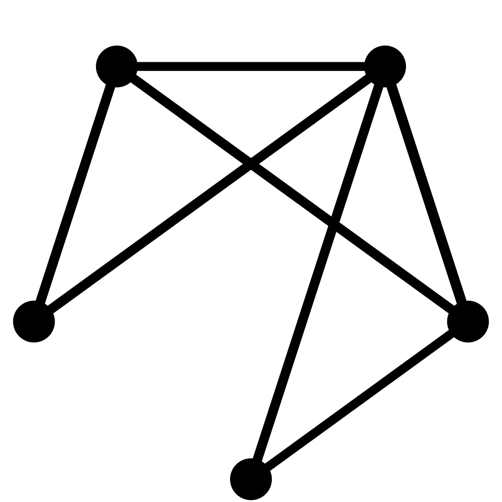

# AutoM

    

Next-generation XOps platform, born to empower the happiness of Site Reliability Engineers (SREs).

This is a next-generation XOps platform that allows you to accomplish nearly all operational tasks. For example, you can manage hosts in a manner similar to how Kubernetes manages pods.

## NOTICE: In order to do a better job of completing this project, I've decided to pause the development of this project until I'm done reading the Kubernetes source code.

I will update my reading progress and insights in [k8s-source-code-tour](https://github.com/atompi/k8s-source-code-tour), and If you are also interested in the Kubernetes source code, please follow this project. Thank you.
