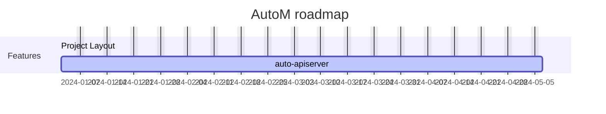

## Roadmap

```mermaid
gantt
    dateFormat  YYYY-MM-DD
    title       AutoM roadmap
    excludes    weekends
    %% (`excludes` accepts specific dates in YYYY-MM-DD format, days of the week ("sunday") or "weekends", but not the word "weekdays".)

    section Features
    Project Layout            :done,    des1, 2024-01-01,2024-01-01
    auto-apiserver            :active,  des2, 2024-01-02, 90d
```
